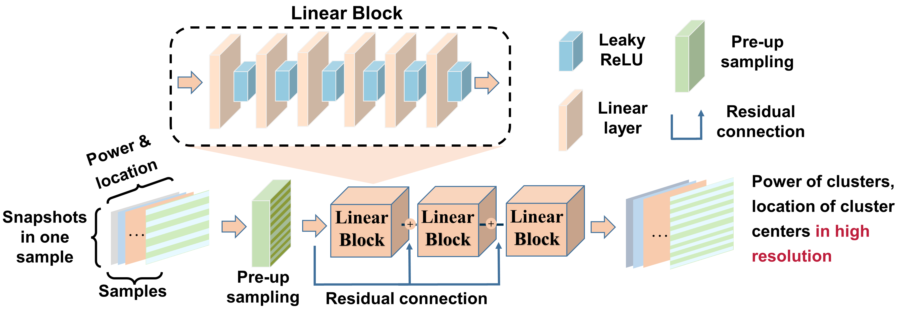
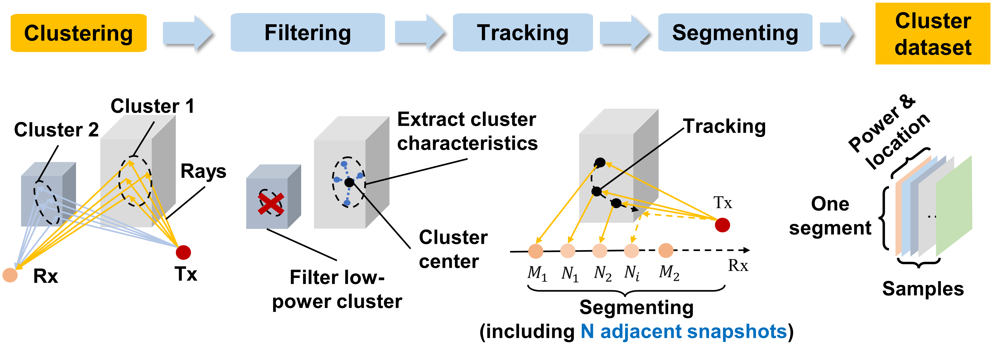

# A-Ray-tracing-and-Deep-Learning-Fusion-Super-resolution-Modeling-Method-for-Wireless-Mobile-Channel



=================================================================================



## Table of Contents

- [Background](#background)
- [Install](#install)
- [Usage](#usage)
- [Dataset](#dataset)
- [Contributing](#contributing)
- [Article](#article)

## Background
### present

Generally, geometry-based stochastic modeling (GBSM) and ray-tracing (RT) based deterministic modeling are two main modeling approaches for mobile channel. GBSM
can theoretically generate channel impulse responses (CIRs) through assumed scattering geometry to analyze performance, but practically the CIRs are evaluated numerically via measurement and calculation. On the other hand, RT can generate highly accurate channel characteristics for specific scenario with the defect of computational complexity. Thereby, a fast and reliable channel characteristic generation method based on coarse-grained RT is desperately needed to accelerate
the modeling process.

Deep learning (DL) based channel modeling methods are getting popular in recent years because of its excellent information integration and inferring ability. Numerous research including our previous work [[1]](https://github.com/lingMori/A-Multi-Task-Learning-Model-for-Super-Resolution-of-Wireless-Channel-Characteristics) are dedicated on large scale channel characteristics prediction, e.g. pathloss, delay spread and number of clusters. Multi-layer perceptron artificial neural network is presented for path loss prediction in [[2]](http://www.cjors.cn/en/article/doi/10.12265/j.cjors.2020209). The author in [[3]](https://www.hindawi.com/journals/wcmc/2018/9783863/) proposes a procedure of predicting channel characteristics based on convolutional neural network (CNN) for multi-dimensional millimeter wave channel characteristicsprediction. However, small scale channel characteristics (e.g.power, angle and location of each cluster) related research based on DL are inadequate.

### our contribution

In this project, we proposed a novel super resolution (SR) model for cluster characteristics prediction.

The proposed method can be used to efficiently and accurately generate big data of mobile channel, which significantly reduces the computation time of RT-only.
Specifically, we make the following contributions:

• Massive RT simulation by self develop [CloudRT](http://cn.raytracer.cloud:9090/) was conducted in four restored scenarios via SketchUp and 3D electronic map and multi-dimensional ray level characteristics data are generated.

• A novel object-based clustering method is presented for better rays division. Special filtering, tracking and segmenting method are utilized to extract crucial characteristics, unify cluster dataset and maintain continuity.

• Multi-layer deep learning model (MLL) is proposed to predict cluster characteristics more accurately. Residual connection and pre-upsampling techniques are integrated for eliminating the vanishing gradients problem and achieving better performance. Ablation study and generalization test demonstrated the necessity of adopted crucial techniques and adaptability of proposed model.

## Install
This project uses [Anaconda](https://www.anaconda.com/) and [PyTorch](https://pytorch.org/)  . Go check them out if you don't have them locally installed.

```
pip3 install torch torchvision torchaudio --extra-index-url https://download.pytorch.org/whl/cu113
```

All the model and demo are based on the PyTorch(1.8.1+cu101) and CUDA(10.1). Please check whether your build version is correct before run this project. **Both Windows and Linux can make through**.


## Usage
Users can download the code above, we specially recommend to download zip to develop the project.

You can run the project with the following command statement.

```
python main.py
```

## Dataset
Workers can use [CloudRT](http://cn.raytracer.cloud:9090/) to build your own Channel Characteristics dataset and convert them into a `.csv` file, then put them into the `data` folder. So we can train our own datasets.

**Note**: If you would like to obtain **a** **well-built dataset**, please contact us by email. Our contact email is `zhaozhang@bjtu.edu.cn`

## Contributing
### Contributors

This project exists thanks to all the people who contribute.


## Article
[A-Ray-tracing-and-Deep-Learning-Fusion-Super-resolution-Modeling-Method-for-Wireless-Mobile-Channel](https://arxiv.org/abs/2301.11557)
